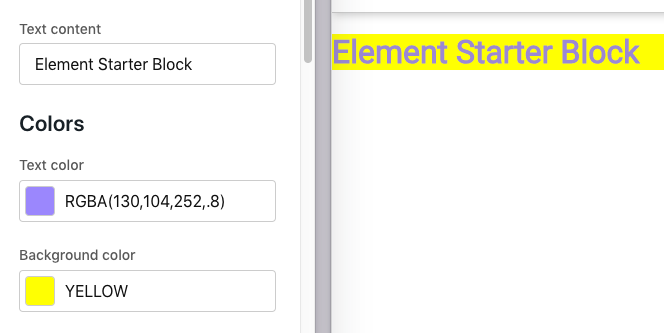

In this how-to guide, we will add new Element Proptypes to an existing Element Block React Component and organize them using an Element Proptype `sectionHeader`.

## 1. Find the Current Block Configs

Open up your block's code and find `/src/configs.js`. It will look something like this:

```javascript
export const getConfigSchema = ElementPropTypes => {
  return {
    text: {
      label: 'Text content',
      type: ElementPropTypes.string,
    },
  }
}

export const defaultConfig = {
  text: 'Element Starter Block',
}
```

## 2. Add a New Element Proptype

Add another proptype to the schema. You will need to provide a label property and a type. For this example, we'll add a `textColor` prop with a PropType of `color`, but look at the "[Proptypes](/references/proptypes)" reference for other available types.

```javascript
export const getConfigSchema = ElementPropTypes => {
  return {
    text: {
      label: 'Text content',
      type: ElementPropTypes.string,
    },
    textColor: {
      label: 'Text color',
      type: ElementPropTypes.color,
    },
  }
}
```

## 3. Add a New Default Value

When you add a new Element Proptype to a schema in `config.js`, you need to give it a default value:

```javascript
export const defaultConfig = {
  text: 'Element Starter Block',
  textColor: 'rgba(130,104,252,.8)',
}
```

## 4. Use the New Prop in the Block

We can now use that new proptype in the block. Open `/src/Block.js` and add a style attribute to the `<h1>` tag assigning our new textColor prop to the color.

```html
<h1 style="{{color:" props.textColor}}></h1>
```

## 5. Add Another Related Element Proptype

Return to `/src/configs.js` and add another prop: `backgroundColor`.

```javascript
export const getConfigSchema = ElementPropTypes => {
  return {
    text: {
      label: 'Text content',
      type: ElementPropTypes.string,
    },
    textColor: {
      label: 'Text color',
      type: ElementPropTypes.color,
    },
    backgroundColor: {
      label: 'Background color',
      type: ElementPropTypes.color,
    },
  }
}
```

## 6. Organize Proptypes with a Section Header

Group the colors together under an `ElementPropTypes.sectionHeader`:

```javascript
export const getConfigSchema = ElementPropTypes => {
  return {
    text: {
      label: 'Text content',
      type: ElementPropTypes.string,
    },
    colorsHeader: {
      type: ElementPropTypes.sectionHeader,
    },
    textColor: {
      label: 'Text color',
      type: ElementPropTypes.color,
    },
    backgroundColor: {
      label: 'Background color',
      type: ElementPropTypes.color,
    },
  }
}
```

## 7. Update Config Schema Usage

Update the default configs to include the new props:

```javascript
export const defaultConfig = {
  text: 'Element Starter Block',
  colorsHeader: 'Colors',
  textColor: 'rgba(130,104,252,.8)',
  backgroundColor: 'yellow', // merchant changes are stored in RBGA
}
```

Go back into `/src/Block.js` and update the style of the `<h1>` to use our new property:

```html
<h1 style={{color: props.textColor, background: props.backgroundColor}}>
```

## 8. View Your Config in Site Designer

Build and update your block:

```shell
npm run build
element update
```

Add your block to a theme, or reload your theme with the block, and you'll see the new props and default values grouped under the "Colors" `sectionHeader`:


