## Table of Contents

- Data
  - [bool](#bool)
  - [category](#category)
  - [color](#color)
  - [editorFull](#editorfull)
  - [editorMinimal](#editorminimal)
  - [embeddable](#embeddable)
  - [image](#image)
  - [number](#number)
  - [oneOf](#oneof)
  - [product](#product)
  - [slider](#slider)
  - [string](#string)
- Meta / Organization
  - [arrayOf shape](#arrayof-shape)
  - [isPrivate](#isPrivate)
  - [readOnly](#readonly)
  - [sectionHeader](#sectionheader)
- More
  - [Further Reading](#further-reading)

## Data

### bool


```javascript
boolean: {
    label: 'Boolean',
    type: ElementPropTypes.bool
}
```

```javascript
export const defaultConfig = {
  boolean: true,
}
```

### category


```javascript
category: {
    label: 'Category',
    type: ElementPropTypes.category
}
```

In the block, `props.category` will be the ID of the category selected by the merchant.

### color

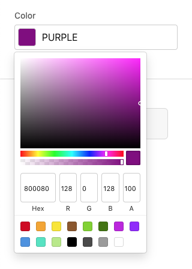

```javascript
color: {
    label: 'Color',
    type: ElementPropTypes.color
}
```

```javascript
export const defaultConfig = {
  color: 'purple', // all CSS color formats accepted
}
```

**Note:** merchant edits to color fields will are stored in RGBA format.

### editorFull


```javascript
editorFull: {
    label: 'Editor Full',
    type: ElementPropTypes.editorFull
}
```

```javascript
export const defaultConfig = {
  editorFull: '<h1>Full WYSIWYG</h1>',
}
```

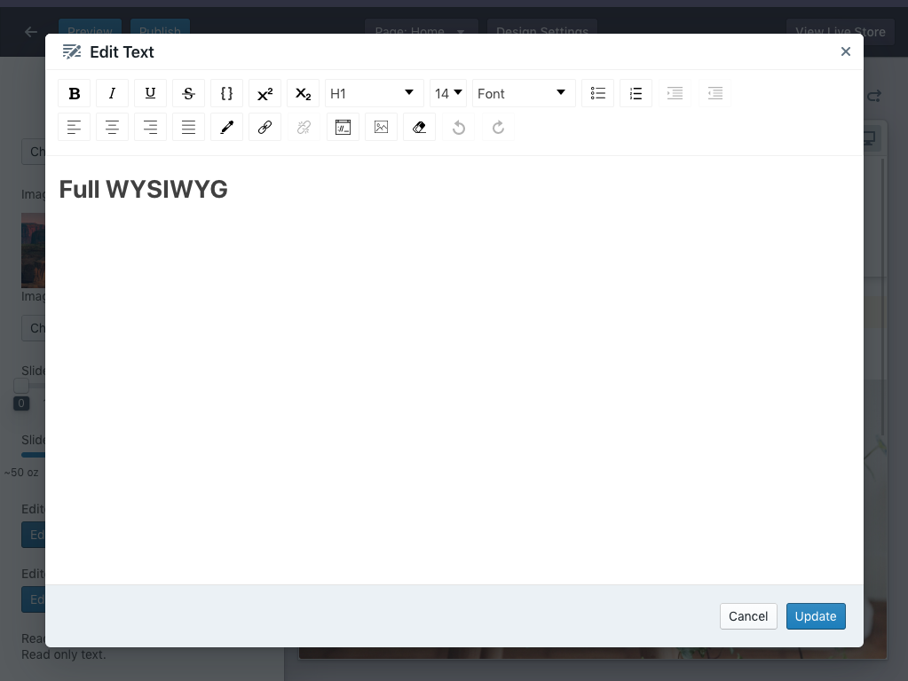

### editorMinimal


```javascript
editorMinimal: {
    label: 'Editor Minimal',
    type: ElementPropTypes.editorMinimal
}
```

```javascript
export const defaultConfig = {
  editorMinimal: '<p>Minimal text editor&#8230;</p>',
}
```

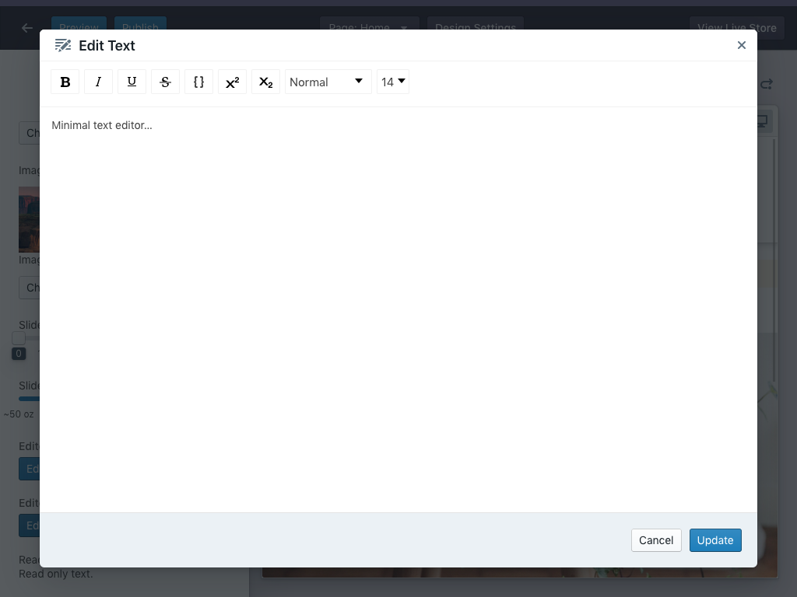

### embeddable

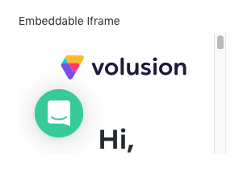

```javascript
embeddable: {
    label: 'Embeddable Iframe',
    type: ElementPropTypes.embeddable({
        embedType: ElementPropTypes.string,
        url: ElementPropTypes.string,
        height: ElementPropTypes.number
    })
}
```

```javascript
export const defaultConfig = {
  embeddable: {
    embedType: 'iframe', // the only supported value
    url: 'https://www.volusion.com/login',
    height: 150,
  },
}
```

### image

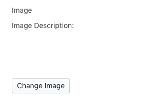

```javascript
image: {
    label: 'Image',
    type: ElementPropTypes.image
}
```

```javascript
import { ElementPropTypes } from '@volusion/element-proptypes'

export const defaultConfig = {
  image: ElementPropTypes.image.default,
}
```

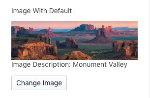

```javascript
imageWithPlaceholder: {
    label: 'Image With Default',
    type: ElementPropTypes.image
}
```

```javascript
export const defaultConfig = {
  imageWithPlaceholder: {
    uriBase: 'http://d21ivvgspl06jm.cloudfront.net/',
    imagePath: 'element-block-assets/slideshow/slide2.jpg',
    altText: 'Monument Valley',
    width: 1600,
    height: 500,
  },
}
```


### number

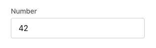

```javascript
number: {
    label: 'Number',
    type: ElementPropTypes.number
}
```

```javascript
export const defaultConfig = {
  number: 42,
}
```

### oneOf

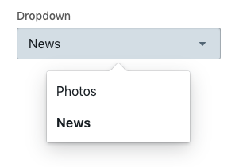

```javascript
oneOf: {
    label: 'Dropdown',
    type: ElementPropTypes.oneOf(['News', 'Photos'])
}
```

```javascript
export const defaultConfig = {
  oneOf: 'News',
}
```

```javascript
export const defaultConfig = {
  arrayOfShapes: [],
}

// or pre-populated
export const defaultConfig = {
  arrayOfShapes: [
    {
      text: 'Link',
      url: 'https://',
    },
  ],
}
```

### product

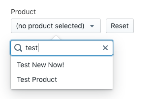

```javascript
product: {
    label: 'Product',
    type: ElementPropTypes.product
}
```

In the block, `props.product` will be the ID of the product selected by the merchant.

### slider

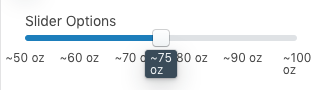

```javascript
sliderOptions: {
    label: 'Slider Options',
    type: ElementPropTypes.slider
}
```

```javascript
import { ElementPropTypes } from '@volusion/element-proptypes'

export const defaultConfig = {
  sliderOptions: {
    labelPrefix: '~',
    labelStepSize: 10,
    labelSuffix: ' oz',
    min: 50,
    max: 100,
    stepSize: 5,
    selectedValue: 75,
    vertical: false,
  },
}
```

### string

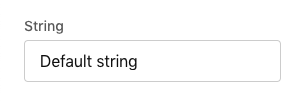

```javascript
string: {
    label: 'String',
    type: ElementPropTypes.string
}
```

```javascript
export const defaultConfig = {
  string: 'Default string',
}
```

## Meta / Organization

### arrayOf shape

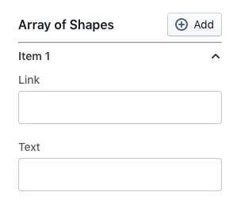

```javascript
arrayOfShapes: {
    label: 'Array of Shapes',
    type: ElementPropTypes.arrayOf(
        ElementPropTypes.shape({
            text: {
                label: 'Text',
                type: ElementPropTypes.string
            },
            url: {
                label: 'Link',
                type: ElementPropTypes.string
            }
        })
    )
}
```

### isPrivate

The `isPrivate` property set to true hides a field from merchants. Agency accounts will still be able to see it.

```javascript
string: {
    label: 'String',
    type: ElementPropTypes.string,
    isPrivate: true
}
```

### readOnly


```javascript
readOnly: {
    label: '',
    type: ElementPropTypes.readOnly
}
```

```javascript
export const defaultConfig = {
  readOnly: 'Read-only text.', // use for instructions, help text
}
```

## sectionHeader


```javascript
sectionHeader: {
  type: ElementPropTypes.sectionHeader
}
```

```javascript
export const defaultConfig = {
  sectionHeader: 'Section Header',
}
```

## More

### Further reading

- [Working with Element Proptypes Tutorial](/tutorials/proptypes)
- [How to: Add Element Proptypes to a Block](/how-to/proptypes)
