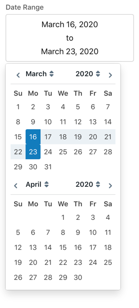

## Table of Contents

- Data
  - [bool](#bool)
  - [category](#category)
  - [color](#color)
  - [date](#date)
  - [dateRange](#daterange)
  - [editorFull](#editorfull)
  - [editorMinimal](#editorminimal)
  - [embeddable](#embeddable)
  - [image](#image)
  - [icon](#icon)
  - [number](#number)
  - [oneOf](#oneof)
  - [product](#product)
  - [slider](#slider)
  - [string](#string)
- Meta / Organization
  - [arrayOf shape](#arrayofshape)
  - [isPrivate](#isprivate)
  - [readOnly](#readonly)
  - [sectionHeader](#sectionheader)
- More
  - [Further Reading](#furtherreading)

## Data

### bool


```javascript
import { ElementPropTypes } from '@volusion/element-proptypes'

export const configSchema = {
  yourBoolPropName: {
    label: 'Boolean',
    type: ElementPropTypes.bool,
  },
}

export const defaultConfig = {
  yourBoolPropName: true,
}
```

### category


```javascript
import { ElementPropTypes } from '@volusion/element-proptypes'

export const configSchema = {
  yourCategoryPropName: {
    label: 'Category',
    type: ElementPropTypes.category,
  },
}

export const defaultConfig = {
  yourCategoryPropName: '',
}
```

In the block, `props.yourCategoryPropName` will be the ID of the category selected by the merchant.

### color


```javascript
import { ElementPropTypes } from '@volusion/element-proptypes'

export const configSchema = {
  yourColorPropName: {
    label: 'Color',
    type: ElementPropTypes.color,
  },
}

export const defaultConfig = {
  yourColorPropName: 'purple', // all CSS color formats accepted
}
```

Merchant edits to color fields are stored in RGBA format.

### date


```javascript
import { ElementPropTypes } from '@volusion/element-proptypes'

export const configSchema = {
    yourDatePropName: {
        label: 'Date',
        type: ElementPropTypes.date
    }
};

export const defaultConfig = {
    yourDatePropName: new Date().toISOString();
};

```

The above example is the recommended method for setting the default date as it will use the date the block is added to page. This proptype will return the date as an ISO string, so be sure your local environment and test prop is also an ISO string.

### dateRange



```javascript
import { ElementPropTypes } from '@volusion/element-proptypes'

export const configSchema = {
  yourDateRangePropName: {
    label: 'Date Range',
    type: ElementPropTypes.dateRange,
  },
}

const today = new Date().toISOString()
let nextWeek = new Date()
nextWeek.setDate(nextWeek.getDate() + 7)
nextWeek = nextWeek.toISOString()

export const defaultConfig = {
  yourDateRangePropName: [
    today, // start date
    nextWeek, // end date
  ],
}
```

The above example is the recommended method for setting default dates as it will use the date the block is added to the page as the starting point. This proptype will return the dates as an ISO string, so be sure your local environment and test props are also ISO strings.

### editorFull


```javascript
import { ElementPropTypes } from '@volusion/element-proptypes'

export const configSchema = {
  yourEditorFullPropName: {
    label: 'Editor Full',
    type: ElementPropTypes.editorFull,
  },
}

export const defaultConfig = {
  yourEditorFullPropName: `<h1>Full WYSIWYG</h1>`, // all CSS color formats accepted
}
```


### editorMinimal


```javascript
import { ElementPropTypes } from '@volusion/element-proptypes'

export const configSchema = {
  yourEditorMinimalPropName: {
    label: 'Editor Minimal',
    type: ElementPropTypes.editorMinimal,
  },
}

export const defaultConfig = {
  yourEditorMinimalPropName: `<h1>Minimal text editor</h1>`, // all CSS color formats accepted
}
```


### embeddable


```javascript
import { ElementPropTypes } from '@volusion/element-proptypes'

export const configSchema = {
  yourEmbeddablePropName: {
    label: 'Embeddable Iframe',
    type: ElementPropTypes.embeddable({
      embedType: ElementPropTypes.string,
      url: ElementPropTypes.string,
      height: ElementPropTypes.number,
    }),
  },
}

export const defaultConfig = {
  yourEmbeddablePropName: {
    embedType: 'iframe', // the only supported value
    url: 'https://www.volusion.com/login',
    height: 150,
  },
}
```

### image

#### Image without specific default values


```javascript
import { ElementPropTypes } from '@volusion/element-proptypes'

export const configSchema = {
  yourImagePropName: {
    label: 'Image',
    type: ElementPropTypes.image,
  },
}

export const defaultConfig = {
  yourImagePropName: ElementPropTypes.image.default,
}
```

#### Image with specific default values


```javascript
import { ElementPropTypes } from '@volusion/element-proptypes'

export const configSchema = {
  yourImagePropName: {
    label: 'Image With Default',
    type: ElementPropTypes.image,
  },
}

export const defaultConfig = {
  yourImagePropName: {
    uriBase: 'http://d21ivvgspl06jm.cloudfront.net/',
    imagePath: 'element-block-assets/slideshow/slide2.jpg',
    altText: 'Monument Valley',
    width: 1600,
    height: 500,
  },
}
```

##### Image picker modal


### icon


```javascript
import { ElementPropTypes } from '@volusion/element-proptypes'

export const configSchema = {
  yourIconPropName: {
    label: 'Pick an Icon',
    tooltip: 'This is the Icon Picker',
    type: ElementPropTypes.icon,
  },
}

export const defaultConfig = {
  yourIconPropName: {
    iconName: '',
    iconPrefix: '',
    defaultFilter: 'social',
  },
}
```

The `defaultFilter` is the string that will pre-populate the filter/search field in the icon picker. Use it to guide the store owner towards a particular set of icons.

### number


```javascript
import { ElementPropTypes } from '@volusion/element-proptypes'

export const configSchema = {
  yourNumberPropName: {
    label: 'Number',
    type: ElementPropTypes.number,
  },
}

export const defaultConfig = {
  yourNumberPropName: 42,
}
```

### oneOf


```javascript
import { ElementPropTypes } from '@volusion/element-proptypes'

export const configSchema = {
  yourOneOfPropName: {
    label: 'One Of',
    type: ElementPropTypes.oneOf(['Photos', 'News']),
  },
}

export const defaultConfig = {
  yourOneOfPropName: 'News',
}
```

### product


```javascript
import { ElementPropTypes } from '@volusion/element-proptypes'

export const configSchema = {
  yourProductPropName: {
    label: 'Product',
    type: ElementPropTypes.product,
  },
}

export const defaultConfig = {
  yourProductPropName: '',
}
```

In the block, `props.yourProductPropName` will be the ID of the product selected by the merchant.

### slider


```javascript
import { ElementPropTypes } from '@volusion/element-proptypes'

export const configSchema = {
  yourSliderPropName: {
    label: 'Slider',
    type: ElementPropTypes.slider,
  },
}

export const defaultConfig = {
  yourSliderPropName: {
    labelPrefix: '~',
    labelStepSize: 10,
    labelSuffix: ' oz',
    min: 50, // required
    max: 100, // required
    stepSize: 5,
    selectedValue: 75, // required
    vertical: false,
  },
}
```

Make sure to reference `props.yourSliderPropName.selectedValue` in your block code.

### string


```javascript
import { ElementPropTypes } from '@volusion/element-proptypes'

export const configSchema = {
  yourStringPropName: {
    label: 'String',
    type: ElementPropTypes.string,
  },
}

export const defaultConfig = {
  yourStringPropName: 'Default string',
}
```

## Meta / Organization

### arrayOf shape


```javascript
import { ElementPropTypes } from '@volusion/element-proptypes'

export const configSchema = {
  yourArrayOfPropName: {
    label: 'Array of Shapes',
    type: ElementPropTypes.arrayOf(
      ElementPropTypes.shape({
        yourTextPropName: {
          label: 'Text',
          type: ElementPropTypes.string,
        },
        yourLinkPropName: {
          label: 'Link',
          type: ElementPropTypes.string,
        },
      })
    ),
  },
}

// unpopulated example
export const defaultConfig = {
  yourArrayOfPropName: [],
}

// pre-populated example
export const defaultConfig = {
  yourArrayOfPropName: [
    {
      yourTextPropName: 'Link',
      yourLinkPropName: 'https://',
    },
  ],
}
```

### isPrivate

The `isPrivate` property set to true hides a field from merchants. Agency accounts will still be able to see it.

```javascript
import { ElementPropTypes } from '@volusion/element-proptypes'

export const configSchema = {
  yourStringPropName: {
    label: 'String',
    type: ElementPropTypes.string,
    isPrivate: true, // <= isPrivate
  },
}
```

### readOnly


```javascript
import { ElementPropTypes } from '@volusion/element-proptypes'

export const configSchema = {
  yourReadOnlyPropName: {
    label: '',
    type: ElementPropTypes.readOnly,
  },
}

export const defaultConfig = {
  yourReadOnlyPropName: 'Read only text.', // use for instructions, help text
}
```

### sectionHeader


```javascript
import { ElementPropTypes } from '@volusion/element-proptypes'

export const configSchema = {
  yourSectionHeaderPropName: {
    label: '',
    type: ElementPropTypes.sectionHeader,
  },
}

export const defaultConfig = {
  yourSectionHeaderPropName: 'Section Header',
}
```

## More

### Further Reading

- [Working with Element Proptypes Tutorial](/tutorials/proptypes)
- [Add Element Proptypes to a Block](/how-to/proptypes)
