This tutorial will cover creating new pages in Element, as well as creating custom blocks that you will put into those new pages.

## Quick Start

If you have built a block before, you can skip down to [Make the Block Fetch Data from an API](#5.maketheblockfetchdatafromanapi) after running this command from the directory where you keep your blocks:

```shell
element new Bloglist && cd Bloglist && npm install && npm start
cd BlogList
git init
git commit -am "Initial commit"
```

## Prerequisites

Before you get started, you need to ensure that your development environment is ready for you to explore Site Designer and create your own blocks.

### An Account with Approval to Create Blocks

The first thing you need is for your Volusion account to be part of an approved organization that can create blocks in the Element ecosystem. To do this, see "[How to Get Approved to Develop Blocks](/how-to/get-approved-to-develop-blocks)."

### Set up Your Development Environment

You also need to set up your environment with Node.js, Git, and Element CLI. For specific step-by-step instructions, see "[Environment Setup](/how-to/env-setup)."

## Create the Blog List Block

If your development environment is set up, you're ready to begin the tutorial. Start by creating a blog list block using your terminal and your favorite text editor or IDE.

### 1. Log in to Element CLI

Open up your terminal and navigate to a good working directory where you'd like to keep your block code. For this tutorial, we will assume you are in a directory called "blocks."

First, log in to Element CLI to ensure that your identity is associated with the block you're about to create. Enter this command into your terminal:

```shell
element login
```

Element CLI will first prompt you for your username, followed by your password. Use your Volusion credentials for this.

If you're successful, you should see output like this:

```shell
blocks $ element login
? Enter your username your.name@example.com
? Enter your password [hidden]
Logged in as your.name@example.com.
```

### 2. Make a New Block with Element CLI

After your login is successful, enter this command into your terminal to create the new block:

```shell
element new Bloglist
```

You should see output that looks like this:

```shell
blocks $ element new Bloglist --git
Cloning boilerplate for Bloglist...
Saved boilerplate to ./Bloglist; now updating...
Updated files Bloglist/local/index.js!
```

A new directory was created called `Bloglist`. Enter this command in your terminal to navigate into the Bloglist directory:

```shell
cd Bloglist
git init
git commit -am "Initial commit"
```

Type this command into your terminal to install the npm packages that your block needs:

```shell
npm install
```

### 3. Start up the Blog List Block for Local Development

Type this command into your terminal to run the block locally:

```shell
npm start
```

You should notice a browser tab open up with the url set to `http://localhost:4000/`. The browser contents should look something like this:


Congratulations! Your block is running locally and is ready for some changes. If this process did not start up a browser tab for you automatically, open a browser tab to `http://localhost:4000/`.

### 4. Open the Files of the Bloglist Directory in Your Text Editor

Use your favorite text editor or IDE to open the files of the Bloglist directory and take a look around. Notice the /src directory: this is where the code for your block lives. Open `/src/Block.js` and look at the [source code](https://github.com/volusion/element-BlockStarter/blob/master/src/Block.js). So far it's pretty simplistic.

#### '/src/Block.js' (initial)

You're going to modify this block so that it does some new things:

- Fetch data from an API to get a list of blog posts
- Use the fetched data to display a list of blog post links
- Add some basic styling

### 5. Make the Block Fetch Data from an API

Data fetching for your block should happen in your getDataProps function so that the block can get the data as a prop. Open `/src/getDataProps.js` in your text editor and take a look at the source:

#### '/src/getDataProps.js' (initial)

```javascript
export const getDataProps = (utils, props) => Promise.resolve()
```

As you can see initially, this function resolves without a value. Modify the source code so that it fetches from a sample API:

#### '/src/getDataProps.js'

```javascript
export const getDataProps = (utils, props) => {
  return utils.client
    .request('https://jsonplaceholder.typicode.com/posts')
    .then(res => res.json())
    .catch(e => [])
}
```

Now that `getDataProps` is requesting the blog posts, you need to set up the block to receive and display them. Switch over to `/src/Block.js` and modify the `Block` function as follows:

#### '/src/Block.js'
```javascript
const Block = props => {
    // the blog posts are now available as props.data
    const { data = [] } = props
    return (
      <React.Fragment>
        <h1>{props.text}</h1>
        <ul>
          {data.map(blog => {
            return (
              <li key={blog.id}>
                <a href={`/blog/${blog.id}`}>{blog.title}</a>
              </li>
            )
          })}
        </ul>
      </React.Fragment>
    )
};
```

In your browser, your block should now be showing the titles of blog posts from the sample API:

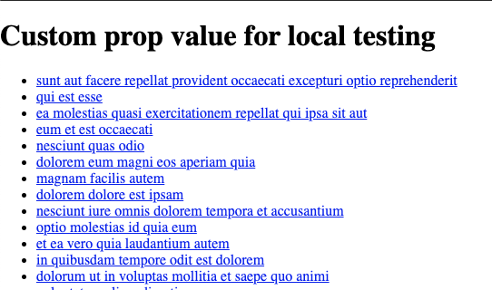

### 6. Make the Blog Titles into Links and Add Some Basic Styling

The block functions alright, but you should enhance its styling. Open `/src/getStyles.js` in your text editor and (take a look at it)[https://github.com/volusion/element-BlockStarter/blob/master/src/getStyles.js]:

Now, add your own style to the object returned by `getStyles`:

#### '/src/getStyles.js'

```javascript
export const getStyles = blockProps => ({
  blogLink: {
    color: 'rgba(50, 168, 82, 0.9)',
    backgroundColor: 'transparent',
    transition: 'all 0.2s ease',
    ':hover': {
      color: 'rgba(20, 100, 90, 1)',
      backgroundColor: '#ffdbf3',
    },
  },
})
```

Blocks use [Aphrodite](https://github.com/Khan/aphrodite) for CSS-in-JS. Aphrodite is already included in the Starter Block. All you need to do is add the new style to your block:

#### 'src/Block.js'

```javascript
const Block = props => {
    // the blog posts are now available as props.data
    const { data = [] } = props

    // Pass the style object returned by `getStyles()` to aphrodite's `StyleSheet.create()`.
    const styles = StyleSheet.create(getStyles(props))

    return (
      <React.Fragment>
        <h1>{props.text}</h1>
        <ul>
          {data.map(blog => {
            return (
              <li key={blog.id}>
                <a href={`/blog/${blog.id}`} className={css(styles.blogLink)}>{blog.title}</a>
              </li>
            )
          })}
        </ul>
      </React.Fragment>
    )
};
```

Your block should now look something like this and have a hover effect for the blog links:

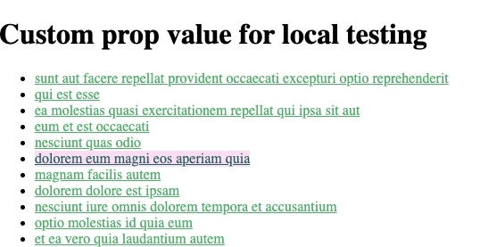

Don't worry about the fonts—those will be applied by the theme later.

### 7. Publish the Blog List Block

Now that your blog list block is looking good, it's time to publish it so that it will be available to add to your theme. Go to your terminal window and terminate the local server by pressing the `q` key, or by pressing `CTRL + C`.

Run this command in your terminal to build the block:

```shell
npm run build
```

You should see output that looks like this:

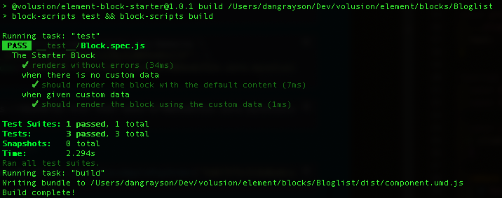

Next, you need to publish the block to the Block Theme Registry. Run this command in your terminal to do so:

```shell
element publish -n "Blog List Tutorial Block"
git commit -am "First release"
git tag 1.0
```

This will present you with a category selection menu that looks like this:

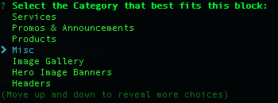

Select the `Misc` option and press enter. You will see output that looks like this:

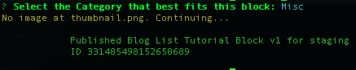

## Create the Blog Detail Block

You have created the blog list block. That's great for showing a list of blog posts, but now you need a block that displays the detailed content of an individual blog entry. This is the blog detail block.

### 1. Make a New Block with Element CLI

Your terminal should still be in the `/blocks/Bloglist` directory. Type this command into your terminal to navigate back to `/blocks`:

```shell
cd ..
```

Type this command into your terminal to make the new BlogDetails block:

```shell
element new Blogdetails
```

Like the blog list block before, you should see output that tells you the operation was successful.

At this point, a new directory was created called `Blogdetails`. Enter this command in your terminal to navigate into the Blogdetails directory:

```shell
cd Blogdetails
git init
git commit -am "Initial commit"
```

Type this command into your terminal to install the npm packages that your block needs:

```shell
npm install
```

### 2. Start up the Blog Details Block for Local Development

Type this command into your terminal to run the block locally:

```shell
npm start
```

Just like with the blog list block, you should notice a browser tab open up with the url set to `http://localhost:4000/`. The browser contents should look something like this:


If this process did not start up a browser tab for you automatically, open a browser tab to `http://localhost:4000/`.

### 3. Open the Files of the Blogdetails Directory in Your Text Editor

Use your favorite text editor or IDE to open the files of the Blogdetails directory. It will have the same initial source code that the blog list block had when we first created it.

You're going to modify this block so that it does some new things:

- Get a blog ID from an ID parameter in the page's URL
- Fetch data from an API for the matching blog post
- Display the matching blog post in the block

### 4. Get a Blog Based on the Id in the Page Path

You're going to use a pageVar to get the blog ID from the page's URL. The first step for doing this is registering the pageVar in your block's config.

Open `/src/configs.js` in your text editor and replace the entire code with this:

#### '/src/configs.js'

```javascript
import { ElementPropTypes } from '@volusion/element-proptypes';

export const configSchema = {
  text: {
    label: 'Text content',
    type: ElementPropTypes.string,
  },
}

export const defaultConfig = {
  text: 'Element Starter Block',
  blogId: 'pageVar:blogId',
}
```

#### '/local/index.js'

Using `pageVar:blogId` in your `defaultConfig` will allow you to grab the blog ID from your URL (seen later in this tutorial), but your local environment URL shouldn't change. This means we'll want to set a local env prop. You can do this through the `props` object in `local/index.js`—just add the key as seen below, and your local environment will load the blog with ID 1.

```javascript
const props = {
  blogId: '1',
}
```

#### '/src/getDataProps.js'

Your `getDataProps` function needs to fetch the matching blog.

Open `/src/getDataProps.js` and replace the entire source code with this:

```javascript
export const getDataProps = (utils, props) => {
  return utils.client
    .request(`https://jsonplaceholder.typicode.com/posts/${props.blogId}`)
    .then(res => res.json())
    .catch(e => [])
}
```

Your block's code needs to show the content of the blog that it received from its data.

Open `/src/Block.js` and replace the entire source code with this:

#### '/src/Block.js'

```javascript
import React from 'react'

import { defaultConfig } from './configs'

function Block(props) {
  const { data: blog = {} } = props
  return (
    <React.Fragment>
      <h1>{props.text}</h1>
      <h2>{blog.title}</h2>
      <p>{blog.body}</p>
    </React.Fragment>
  )
}
Block.defaultProps = defaultConfig

export default Block
```

### 6. Publish the Blog Details Block

The blog details block is done, so it's time to publish it. Go to your terminal window and terminate the local server by pressing the `q` key, or by pressing `CTRL + C`.

Run this command in your terminal to build the block:

```shell
npm run build
```

You should see output that looks like this:

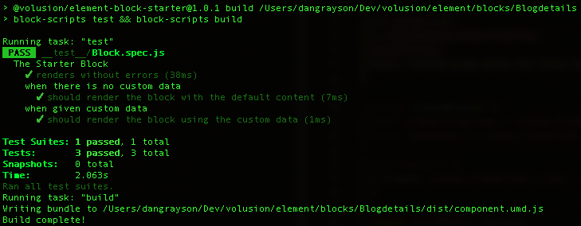

Next, you need to publish the block to the Block Theme Registry. Run this command in your terminal to do so:

```shell
element publish -n "Blog Details Tutorial Block"
git commit -am "First release"
git tag 1.0
```

This will present you with a category selection menu that looks like this:


Select the `Misc` option and press enter. You will see output that looks like this:

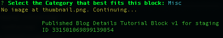

## Create a New Theme to Work with

Now that you've published your blocks, the next thing you'll want to do is create a new theme to work with. You will make two pages inside this theme and put your blocks into those pages, but first you need a theme as an isolated workspace. Themes are the parent construct to pages.

### 1. Open Site Designer

In the web browser of your choice, sign in to [Volusion.com](https://www.volusion.com/login) with your approved developer account, and click the **Site Designer** link in the sidebar navigation:


### 2. Create a New Theme

Click the **Create new theme** link in Site Designer.

_Note: if Site Designer directed you straight to your active theme, first click the **Change Theme** link near the top of the screen (next to your theme name)._


This will launch a dialog for you to enter your theme name:


Enter "Blog Test Theme" as the name for your theme, then click the **Create** button.

## Add a New Page for Your Blog List Block

After creating your new theme, Site Designer will navigate you to the home page for your theme. Next, you'll need to add a page where your blog list block will live. To do this, open the page selection drop-down that says **Page: Home**, revealing the "Add a Page" menu option:


Click the **Add a Page** link, which will open a panel in the sidebar:

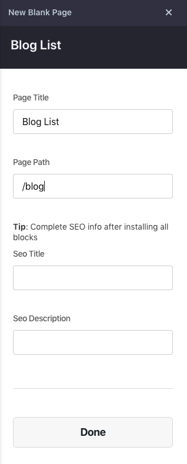

Fill out the first two fields:

1. Page Title: `Blog List`
2. Page Path: `/blog`

_Note: make sure you have a `/` character at the start of `/blog`._

Leave the rest of the fields blank, then click the **Done** button at the bottom of the panel.

Site Designer will redirect you to your new Blog List page.

## Add the Blog List Block to Its Page

Click the **Add Block** link:


This will open the "Add a Block" panel, where you can select from block categories. Click on the **Misc** category—you'll recall this was the category you published your blocks into earlier.

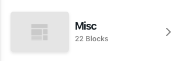

Locate the "Blog List Tutorial Block" you published, and click the **Add Block** button:

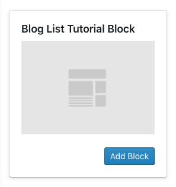

You should see your blog list block appear in the main panel of Site Designer. It should look something like this:

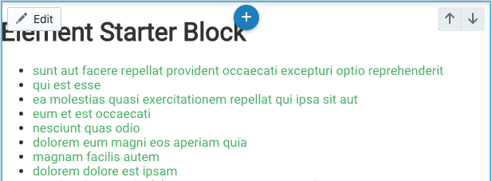

## Add a New Page for Your Blog Detail Block

Now that you've created the blog list page and added the block to it, you need to do the same for the blog detail.

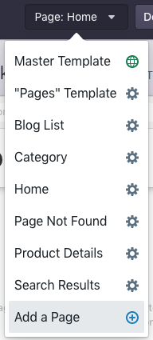

Click the **Add a Page** link, which will open a panel in the sidebar:

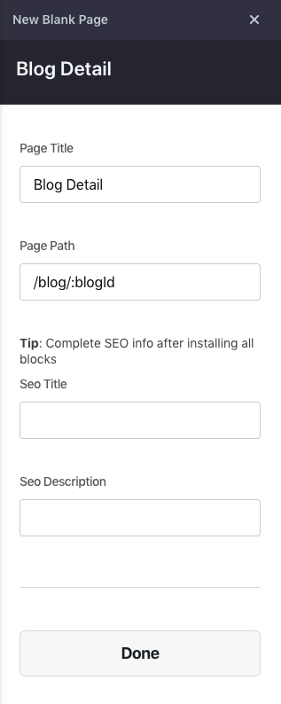

Fill out the first two fields:

1. Page Title: `Blog Detail`
2. Page Path: `/blog/:blogId`

_Note: make sure you have a `/` character at the start of `/blog/:blogId`. Notice also that the **:blogId** matches the variable name you used earlier in the blog detail block._

Leave the rest of the fields blank, then click the **Done** button at the bottom of the panel.

Site Designer will redirect you to your new Blog Detail page.

## Add the Blog Detail Block to Its Page

Click the **Add Block** link:


This will open the "Add a Block" panel, where you can select from block categories. Click on the **Misc** category—you'll recall this was the category you published your blocks into earlier.


Locate the "Blog Detail Tutorial Block" that you published, and click the **Add Block** button:

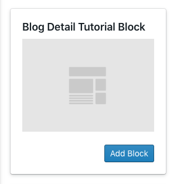

You should see your blog detail block appear in the main panel of Site Designer. It should look something like this:

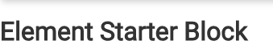

## See the Blocks in Your Theme Preview

You're done setting up the blocks, and it's finally time to see how everything works together. First, click the **Block List** page in Site Designer using the page selection menu:

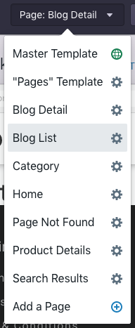

Next, click the **Preview** button near the top of the Site Designer window:


This will launch a new browser tab with your blog list page. The page URL will be something like:

```shell
https://6860d41f-7f19-4aff-b528-a17da7b6ca55.myvolusion.com/blog
```

And the contents will look like this:

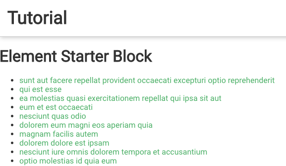

Click one of the blog links, and you will go to the detail page for that blog post:

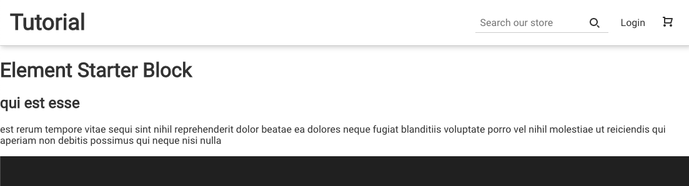

Notice that the page URL now has a blog ID in the path:

```shell
https://6860d41f-7f19-4aff-b528-a17da7b6ca55.myvolusion.com/blog/2
```

Click your browser's back button to get back to the blog list page and explore more blog details.
