In this tutorial, we'll build a new block to handle the display of an individual product and its interactions with the shopping cart. This could be an SEO landing page, a page you want to drive ad traffic to, or a replacement for the Product Details block with more capabilities.

## Quick Start

If you have built a block before, you can skip down to [Get a Product Based on the Slug in the Page Path](#5.getaproductbasedonthesluginthepagepath) after running this command from the directory where you keep your blocks:

```shell
element new Productlanding && cd Productlanding && npm install && npm start
```

## Prerequisites

Before you get started, you need to ensure that your development environment is ready for you to explore Site Designer and create your own blocks.

### An Account with Approval to Create Blocks

The first thing you need is for your Volusion account to be part of an approved organization that can create blocks in the Element ecosystem. To do this, see "[How to Get Approved to Develop Blocks](/how-to/get-approved-to-develop-blocks)."

### Setting up Your Development Environment

You also need to set up your environment with Node.js, Git, and Element CLI. For specific step-by-step instructions, see "[Environment Setup](/how-to/env-setup)."

## Create the Product Landing Block

If your development environment is set up, you're ready to begin the tutorial. Start by creating a product landing block, using your terminal and your favorite text editor or IDE.

### 1. Log in to Element CLI

Open up your terminal and navigate to a good working directory where you'd like to keep your block code. For this tutorial, we will assume you are in a directory called "blocks."

First, log in to Element CLI to ensure that your identity is associated with the block you're about to create. Enter this command into your terminal:

```shell
element login
```

Element CLI will first prompt you for your username, followed by your password. Use your Volusion credentials for this.

If you're successful, you should see output like this:

```shell
blocks $ element login
? Enter your username your.name@example.com
? Enter your password [hidden]
Logged in as your.name@example.com.
```

### 2. Make a New Block with Element CLI

After your login is successful, enter this command into your terminal to create the new block:

```shell
element new Productlanding
```

You should see output that looks like this:

```shell
blocks $ element new Productlanding
Cloning boilerplate for Productlanding...
Saved boilerplate to ./Productlanding; now updating...
Updated files Productlanding/local/index.js!
```

A new directory was created called `Productlanding`. Enter this command in your terminal to navigate into the Productlanding directory:

```shell
cd Productlanding
git init
git commit -am "Initial commit"
```

Type this command into your terminal to install the npm packages that your block needs:

```shell
npm install
```

### 3. Start up the Product Landing Block for Local Development

Type this command into your terminal to run the block locally:

```shell
npm start
```

You should notice a browser tab open up with the URL set to `http://localhost:4000/`. The browser contents should look something like this:

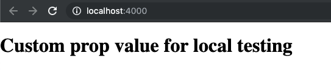

Congratulations! Your block is running locally and is ready for some changes. If this process did not start up a browser tab for you automatically, open a browser tab to `http://localhost:4000/`.

### 4. Open the Files of the Productlanding Directory in Your Text Editor

Use your favorite text editor or IDE to open the files of the Productlanding directory and take a look around. Notice the /src directory: this is where the code for your block lives.

### 5. Get a Product Based on the Slug in the Page Path

You're going to use a pageVar to get the product slug from the page's URL. The first step for doing this is registering the pageVar in your block's config.

#### 'src/configs.js'

Open `src/configs.js` in your text editor and replace the entire code with this:

```js
export const getConfigSchema = ElementPropTypes => {}

export const defaultConfig = {
  productSlug: 'pageVar:pageUrlText',
}
```

#### 'src/getDataProps.js'

Your `getDataProps` function needs to fetch the matching product.

Open `src/getDataProps.js` and replace the entire source code with this:

```js
export const getDataProps = (utils, { productSlug }) => {
  const { client, isRendering } = utils
  if (isRendering || productSlug !== 'pageVar:pageUrlText') {
    return client.products.getBySlug(productSlug).catch(() => {})
  } else {
    return client.products
      .search({ query: '', pageSize: 1 })
      .then(data => data.items[0])
  }
}
```

**Note:** the second argument to `getDataProps()` is the block's props, which are destructured in place.

#### 'local/index.js'

You will now set up your block so that it can simulate being inside of a theme and get real data. It's always faster when you can develop something locally.

The first step is to find your Tenant ID. From Site Designer, click on the **View store** button. View source and search for "tenant". There are several instances; you might find something like this:

```js
window.ElementSdk.client.configure({tenant: "586aa7bc3e140400156259a5"
```

Back in your IDE, open `local/index.js` and find this line:

```js
const tenantId = '$YOUR_TENANT_ID'
```

Update it with your tenant from the browser source:

```js
const tenantId = '586aa7bc3e140400156259a5'
```

Next, you'll find a product slug and pass it to the local preview of your block. Back in your browser, find a product in your store and grab the slug from the URL (the text after `/p/`); for example, ...com/p/**water-bottle**.

Back in `local/index.js`, find where `props` are defined:

```js
const props = {
  ...blockModule.defaultConfig,
  text: 'Custom prop value for local testing',
}
```

Replace the `text` prop with `productSlug` and the value from the browser:

```js
const props = {
  ...blockModule.defaultConfig,
  productSlug: 'water-bottle',
}
```

#### 'src/Block.js'

Your block's code needs to show the content of the product that it received from its data.

Open `src/Block.js` and replace `return <h1>{props.text}</h1>;` with this:

```js
const product = props.data

if (!product.id) {
  return <h1>Product Landing Block</h1>
}
return <h1>{product.name}</h1>
```

#### Block Testing Spec

For now, you'll want to skip the tests. Open `__test__/Block.spec.js`, and put a "`.skip`" after the first `describe`.

```js
describe.skip('The Starter Block', () => {
```

### 6. Look at Your Block in the Browser

Run `npm start` in your terminal, then switch back to your browser window. Your block should look something like this:

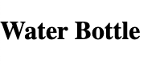

#### Troubleshooting

If the browser window is blank, then you'll have to do some debugging. Open up your developer console and see if there's a helpful error message. If your block says "Product Landing Block," then there was a problem getting your product data. Look to see if you have any network errors, and double check the Tenant ID and productSlug you have set in `local/index.js`. There may not even be any errors, just a GET request to `/store/products` with an empty `items` array in the response.

If none of that helps, review the steps above again.

### 7. Publish the Product Landing Block

The product landing block is done for now, so it's time to publish it. Go to your terminal window and terminate the local server by pressing the `q` key, or by pressing `CTRL + C`.

Run this command in your terminal to build the block:

```shell
npm run build
```

You should see output that looks like this:

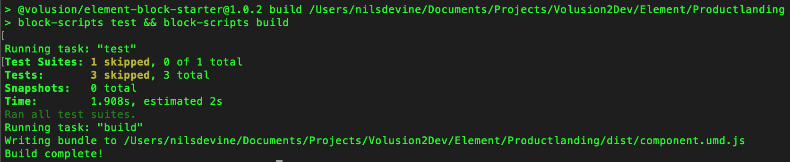

Next, you need to publish the block to the Block Theme Registry. Run this command in your terminal to do so:

```shell
element publish -n "Product Landing Tutorial Block"
git commit -am "First release"
git tag 1.0
```

This will present you with a category selection menu that looks like this:

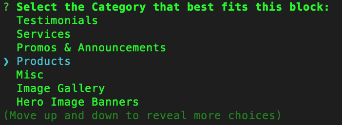

Select the `Products` option and press enter. You will see output that looks like this:

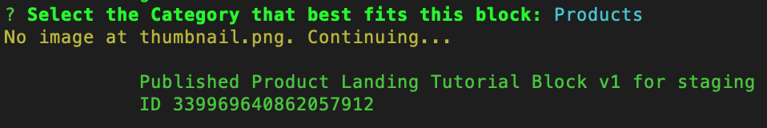

**Note for later about the "No image" warning:** you can find details on the thumbnail.png image requirements in "[Element CLI](/references/element-cli#publish).")

## Create a New Theme

Now that you've published your block, the next thing you'll want to do is create a new theme to work with. You will make a page inside this theme and put your block into that page, but first you need a theme as an isolated workspace. Themes are the parent construct to pages.

### 1. Open Site Designer

In the web browser of your choice, sign in to [Volusion.com](https://www.volusion.com/login) with your approved developer account, and click the **Site Designer** link in the sidebar navigation:

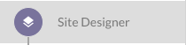

### 2. Create a New Theme

Click the **Create new theme** link in Site Designer.

_**Note:** If Site Designer directed you straight to your active theme, first click **Change Theme** near the top of the screen (next to your theme name)._

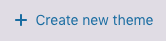

This will launch a dialog for you to enter your theme name:

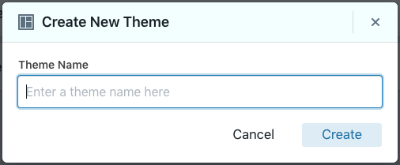

Enter "Product Landing Test Theme" as the name for your theme, then click the **Create** button.

## Add a New Page for Your Product Landing Block

You now need to create a page for your product landing block.

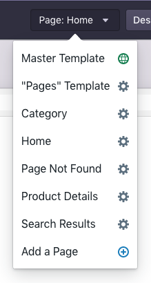

Click the **Add a Page** link, which will open a panel in the sidebar:

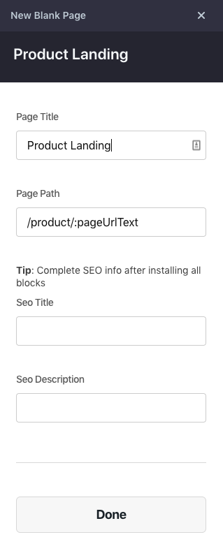

Fill out the first two fields:

1. Page Title: `Product Landing`
2. Page Path: `/product/:pageUrlText`

_**Note 1:** Make sure you have a `/` character at the start of `/product/:pageUrlText`. Notice also that the **:pageUrlText** matches the variable name you used earlier in the product landing configs._

_**Note 2:** If you decide to use this page to replace the Product Details, you must use the path `/p/:pageUrlText` or unexpected breaks may occur, such as the sitemap._

Leave the rest of the fields blank, then click the **Done** button at the bottom of the panel.

Site Designer will redirect you to your new Product Landing page.

## Add the Product Landing Block to Its Page

Click the **Add Block** link:

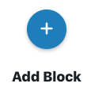

This will open the "Add a Block" panel, where you can select from block categories. Click on the **Misc** category—you'll recall this was the category you published your blocks into earlier.

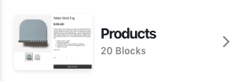

Locate the "Product Landing Tutorial Block" that you published, and click the **Add Block** button:

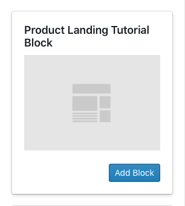

You should see your product landing block appear in the main panel of Site Designer. It should look something like this, but with the name of an arbitrary product from your store:

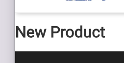

If there is an error at this point, refresh your browser window and choose **Product Landing** from the page drop-down again. You may also have to navigate back to editing your theme after refreshing the page.

## Preview Your Page

Click the **Preview** button near the top of the Site Designer window:

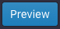

This will launch a new browser tab with your blog list page.

Navigate or use the search to locate a product details page. The URL will be something like:

`https://e9bd448c-a462-4518-98f3-9dadb57a8d8b.myvolusion.com/p/water-bottle`

Replace the `/p/` with `/product/` to load the product landing page. Your header will be different, but your block should look something like this (in this case, the product name was "River Tam Sticker"):

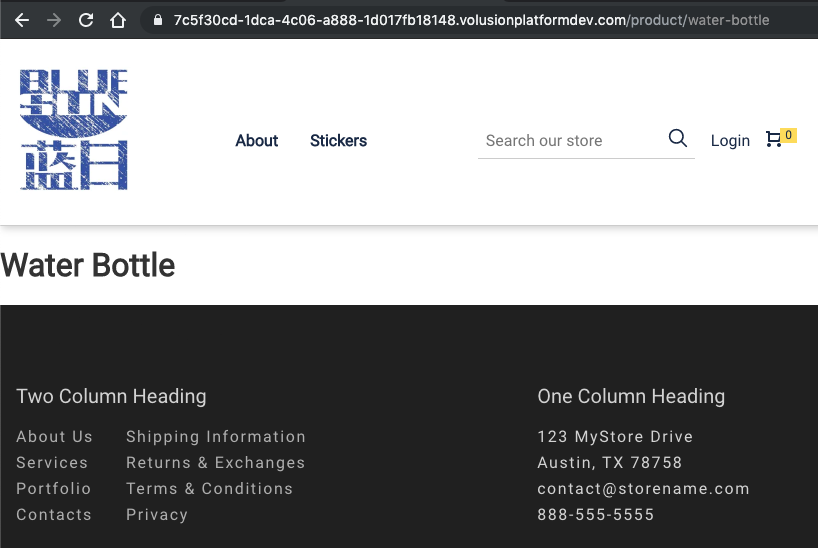

## Build an "Add to Cart" Button

Now that you know that product data is loading, you can update the block with a button to add the product to the cart.

### 'src/Block.js'

In `src/Block.js`, replace the `StarterBlock` function with this code. Remember, replace only that function, not the whole file.

```jsx
function StarterBlock(props) {
  const product = props.data

  if (!product.id) {
    return <h1>Product Landing Block</h1>
  }

  const addToCart = () => {
    const productVariant = {
      productId: product.id,
      quantity: 1,
      variantId: product.productVariants[0].id,
      itemPrice: product.productVariants[0].price,
    }
    props.pubSub.publish(props.events.cart.addToCart, productVariant)
  }

  return (
    <React.Fragment>
      <h1>{product.name}</h1>
      <button onClick={addToCart}>Add to Cart</button>
    </React.Fragment>
  )
}
```

### Update the Block

Return to the terminal that's open to your `Productlanding` directory. Build the block, and then use Element CLI to update it.

```shell
npm run build
element update
```

You should see output similar to this:

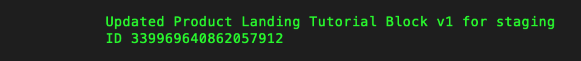

### Try It Out

Go back to the browser that's open to your product landing page and refresh it. You should see an "Add to Cart" button appear under the product name, like this:

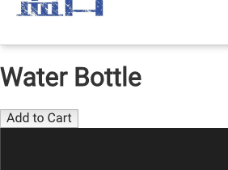

Click it, and the cart panel will open with your product in it.

## Support Product Variants

Product variants allow a store owner to control the price, availability, and photos associated with alternative types of the same product; for example, different sizes of a T-Shirt.

### Volusion Product with Variants

You'll need to find or make a product that has variants. Go to [Volusion Admin](https://admin.volusion.com) and click into the **Products** section. It should be accessible via an icon like this:


Set up variants for a product. When you're done, it might look something like this:

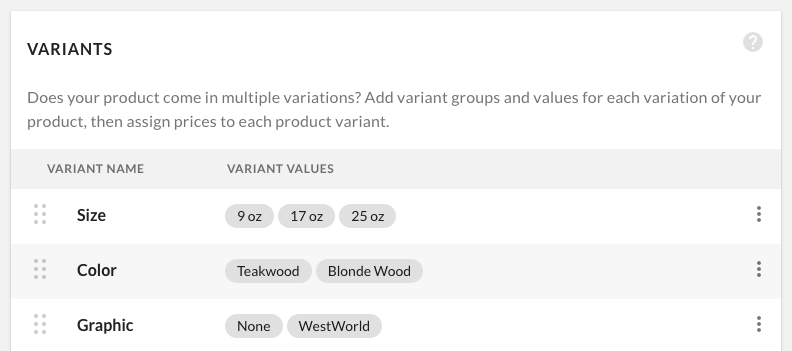

Here is some [product variants help](https://help.volusion.com/en/articles/461911-product-variants) if you need it.

#### 'local/index.js'

Copy the "Page URL text" from your product that has variants, and make sure that it matches the `productSlug` assigned to `const props` in `local/index.js`.

```js
const props = {
  ...blockModule.defaultConfig,
  productSlug: 'water-bottle',
}
```

### 'src/Block.js'

Now, you'll need to update the block so that those variant options are displayed as drop-downs. When the shopper makes a different selection, the variant sent to the cart should change.

In `src/Block.js`, update the React import statement at the top of the file to include the `useState` hook:

```js
import React, { useState } from 'react'
```

Then, in the same file, replace just the `StarterBlock` function with this code:

```jsx
function StarterBlock(props) {
  const product = props.data

  if (!product.id) {
    return <h1>Product Landing Block</h1>
  }

  const [selectedOptions, setSelectedOptions] = useState(
    getInitialSelectedOptions()
  )
  const [selectedVariant, setSelectedVariant] = useState(
    getVariantFromOptions()
  )

  React.useEffect(() => {
    setSelectedVariant(getVariantFromOptions())
  }, [selectedOptions])

  function getInitialSelectedOptions() {
    return product.variantOptions.map(optionCategory => {
      return optionCategory.options[0]
    })
  }

  function getVariantFromOptions() {
    if (selectedOptions.length === 0) {
      return product.productVariants[0]
    }
    return product.productVariants.find(variant => {
      return !variant.variants.some((value, index) => {
        return selectedOptions[index] !== value
      })
    })
  }

  function addItem() {
    const productVariant = {
      productId: product.id,
      quantity: 1,
      variantId: selectedVariant.id,
      itemPrice: selectedVariant.price,
    }
    props.pubSub.publish(props.events.cart.addToCart, productVariant)
  }

  function onOptionSelected(value, index) {
    const updatedSelection = [...selectedOptions]
    updatedSelection[index] = value
    setSelectedOptions(updatedSelection)
  }

  return (
    <>
      <h1>{product.name}</h1>
      <p>
        {selectedVariant ? (
          <span>${selectedVariant.price}</span>
        ) : (
          <span>Option not availble.</span>
        )}
      </p>
      <button onClick={addItem}>Add to Cart</button>
      {product.variantOptions.map((optionCategory, index) => (
        <React.Fragment key={`optionCategory${index}`}>
          <label> {optionCategory.name} </label>
          <select onChange={e => onOptionSelected(e.target.value, index)}>
            {optionCategory.options.map((option, optionIndex) => (
              <option key={`option${optionIndex}`} value={option}>
                {option}
              </option>
            ))}
          </select>
        </React.Fragment>
      ))}
    </>
  )
}
```

### Test It Locally

Go back to the terminal that's open to your block's directory and run this command:

```shell
npm start
```

It should look something like this:

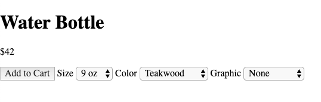

When you change the "Color" and "Size" values, you will see the price change to reflect the price of the selected variant. Do _not_ press "Add to Cart;" `pubSub` is not supported locally, and the block needs to be loaded within a theme to have access to the [cart events](/references/cart-events).

### Update Your Block

Now that we're done testing locally, stop your server and run these commands in your terminal to build and update the block:

```shell
npm run build
element update
```

### Preview the Block

Copy the "Page URL text" from your product that has variants, and go back to the browser with the `/products/` page preview, replacing the product slug in the URL. It should look something like this:

`https://7c5f30cd-1dca-4c06-a888-1d017fb18148.volusionplatformdev.com/product/water-bottle`

The page will look something like this:

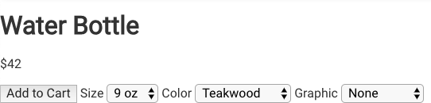

Now you will be able to choose a different variant and add it to your cart.

## Production Quality Code & Features

What you've created here is the most basic functional version of a Product block—it could use some [styling](/how-to/style-a-block-with-aphrodite). Beyond that, here are some features and code improvements that you should consider before using this block in a store:

1. Hidden variants will show the message `"Option not available."`, but they will throw an error if you try to add them to the cart. It would be wise to disable the "Add to Cart" button if selectedVariant is `undefined`.
2. You may wish to add form controls that allow the user to change the quantity of the item in the cart using [props.events.cart.updateCartCount](/references/cart-events#updatecartcount).
3. Utility functions such as `getVariantFromOptions` should be pulled out into a service where they would be easier to cover with unit tests. The tests would also serve the dual purpose of documenting the function.
4. You should rename the `StarterBlock` component to something else, maybe `ProductLanding`? We're using the default export, so the name change will be limited to `src/Block.js`.
5. The component in `src/Block.js` is about ready to be split up into smaller components. You could move the code that displays the select menus, starting with `product.variantOptions.map`, to a new component.
6. If you log the `product` and `selectedVariant` (see below) and update the block, you may see they have data that this component is not using yet. One piece that you probably want to display is the images. You should also know that Product Variants have images too, and you may decide to change which image is visible when a shopper chooses a variant that has images. (see [Images for Variants](https://help.volusion.com/en/articles/1724914-product-variants-images-for-variants))

```js
React.useEffect(() => {
  console.log({ product, selectedVariant })
}, [selectedVariant])
```

## Further Reading

- [Styling a Block with Aphrodite](/how-to/style-a-block-with-aphrodite)
- If you were going to make this an SEO landing page you'll want to read the [Set Seo Data from a Block](/how-to/set-seo-data-from-a-block) how-to.
- To add more controls to change the cart, and also respond to changes from the cart panel, read [How to Interact with the Cart](/how-to/interact-with-the-cart) and [Cart Events Reference](/references/cart-events)
