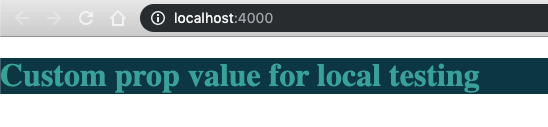
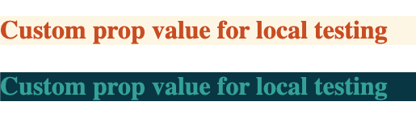
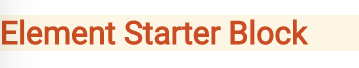
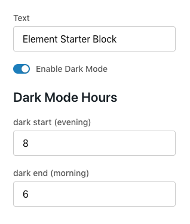

In this 15 minute tutorial you will learn how to create a block with a configurable light and dark modes.


## Prerequisites

- [Basic understanding of blocks](explanations/element-concepts)
- [Element CLI installed](/how-to/env-setup)

## Create a New Block

Create a new block named Solarized. If you haven't used element before, see [How to Set Up your Environment for Developing Blocks](/how-to/env-setup).

```shell
element new Solarized
```

## Locate the Block Configuration and Schema

Open up your block's code and find `/src/configs.js`. In that file you'll see `getConfigSchema`. This is where you tell Site Designer what configuration fields are available for your block. Store admins will be able to edit the settings of your block using those fields. By default, `getConfigSchema` looks like this:

```javascript
export const getConfigSchema = ElementPropTypes => {
  return {
    text: {
      label: 'Text content',
      type: ElementPropTypes.string,
    },
  }
}
```

## Add a New Element Proptype

In the object literal returned by `getConfigSchema` we will add the property `isDarkModeEnabled`, which is how we'll reference it from the block's component code. We'll give it the `label` "Enable Dark Mode" which appears above the field in the Site Designer's edit panel. For the `type` make it an `ElementPropTypes.bool`, which represents a boolean field. Your `getConfigSchema` should now look like this:

```javascript
export const getConfigSchema = ElementPropTypes => {
  return {
    text: {
      label: 'Text content',
      type: ElementPropTypes.string,
    },
    isDarkModeEnabled: {
      label: 'Enable Dark Mode',
      type: ElementPropTypes.bool,
    },
  }
}
```

when you add a new Element Proptype to a schema you need to give it a default value in `config.js`. You do this by adding default values to the `defaultConfig` object:

```javascript
export const defaultConfig = {
  text: 'Element Starter Block',
  isDarkModeEnabled: true,
}
```

## Set up the "Dark" And "Light" Styles

In this step, we define the colors for the light and dark modes. Open up `/src/getStyles.js` and update the code to look like this:

```javascript
export const getStyles = blockProps => {
  return {
    dark: {
      color: 'rgb(50,161,152)',
      background: 'rgb(10,54,66)',
    },
    light: {
      color: 'rgb(201,76,34)',
      background: 'rgb(253,246,228)',
    },
  }
}
```

## Use the New Proptype in the Block

Open `/src/Block.js`. We'll now edit it so that it uses the new `isDarkModeEnabled` prop. Any Element Proptypes that you add to the config schema will be available in the props passed to the block's component.

Locate the place where the block returns some JSX:

```html
return
<h1>{props.text}</h1>
;
```

Update the code above to this:

```javascript
// import the aphrodite utils
import { css, StyleSheet } from 'ahrodite'
import { getStyles } from './getSyles'

// create your dynaimc classes
const classes = StyleSheet.create(getStyles(props))

// add logic to determine which class to apply
const modeClass = isDarkModeEnabled ? css(classes.dark) : css(classes.light)

return <h1 className={modeClass}>{text}</h1>
```

That's it! Now we'll preview our work locally.

## Run the Block Locally

Make sure that you have all your dependencies loaded, and then start up the block in watch mode. Run these from terminal in your block's directory:

```shell
npm install
npm start
```

That will launch a browser window where you'll get preview of the block that will update as you make changes.



## Add a New Config Section

Let's create a section in the Site Designer for configuring the Dark Mode fields. To do this, we'll first add the configurable fields to our schema and then add a `sectionHeader` for Dark Mode. Back in `config.js`, inside `getConfigSchema`, add this new `sectionHeader` and the two number fields below `isDarkModeEnabled`.

```javascript
isDarkModeEnabled: {
    label: 'Enable Dark Mode',
    type: ElementPropTypes.bool
},
darkModeHeader: {
    type: ElementPropTypes.sectionHeader
},
darkStart: {
    label: 'dark start (evening)',
    type: ElementPropTypes.number
},
darkEnd: {
    label: 'dark end (morning)',
    type: ElementPropTypes.number
}
```

Update `defaultConfig` to include the text of our header and the default values of our two new fields.

```javascript
isDarkModeEnabled: true,
darkModeHeader: 'Dark Mode Hours',
darkStart: 8,
darkEnd: 6
```

Save your work.

## Use 'darkStart' and 'darkEnd' in the Block

We're going to update the block component so that it compares the current time to our new `darkStart` and `darkEnd` to decide what styles to use. If the current time is after `darkStart` and before `darkEnd` we'll enable dark mode.

In `Block.js`, find the code that's reading the props,

```javascript
// read our new prop, and what we'll need to get our styles
const { isDarkModeEnabled, text } = props
```

and update it so that it's getting the new `darkStart` and `darkEnd` properties:

```javascript
const { isDarkModeEnabled, darkEnd, darkStart, text } = props
```

Next, add the code that determines if we are in light or dark mode. The full, commented code is:

```javascript
// get the current hour
const now = new Date().getHours()

// if somebody entered a dark start value less than 12, assume they are using a 12 hour clock and convert it to 24 hour time.
const pmStart = darkStart < 12 ? darkStart + 12 : start

// is it darktime in the user's time zone?
const isDark = pmStart <= now || now < darkEnd

// use dark mode if dark mode is enabled and it is darktime
const isDarkMode = isDarkModeEnabled && isDark
```

Here is what it should look like all together, without the comments:

```javascript
import { css, StyleSheet } from 'ahrodite'
import { getStyles } from './getSyles'

const classes = StyleSheet.create(getStyles(props))

const { isDarkModeEnabled, darkEnd, darkStart, text } = props

const now = new Date().getHours()
const pmStart = darkStart < 12 ? darkStart + 12 : start
const isDark = pmStart <= now || now < darkEnd
const isDarkMode = isDarkModeEnabled && isDark
const modeClass = isDarkMode ? css(classes.dark) : css(classes.light)

return <h1 className={modeClass}>{text}</h1>
```

Save your work.

## View the Results Locally

Go back to your browser. Now you will see either dark or light styles depending on the current time:



## Preview Config Changes

To see what it will be like when store admins change the configuration of your block in Site Designer, let's change the configs going into your block. Open `/local/index.js` and find this:

```javascript
const props = {
  ...blockModule.defaultConfig,
  text: 'Custom prop value for local testing',
}
```

Replace the text with whatever you would like, and give it the rest of our `defaultConfig` properties from `/src/configs.js`:

```javascript
text: 'Light or Dark',
isDarkModeEnabled: true,
darkStart: 8,
darkEnd: 6
```

Now change the start/end so that your local preview will switch modes. For example, if the current time is 10:00 in the morning, change the `end` to 11 so that the block still thinks it should render in dark mode.

Open your browser and see the change:


## View the Config in Site Designer

From your terminal, build and publish the block. It will prompt you to select a category, choose `Misc`.

```shell
npm run build
element publish -n "Proptypes Tutorial"
```

In your browser, go to [Site Designer](https://admin.volusion.com/designer). Edit a theme, and use the Add Block button to add your block to the theme.


Hover over the block to reveal the edit button.



Press the edit button and you'll be able to see the form generated by the config schema we've been working with.



Use the Preview button to test changes made to the Dark Mode Hours.

Changes made to the block config in Site Designer to the `darkStart` and `darkEnd` fields will not update the block in real time. This is because our `isDarkMode` logic above is triggered one time when the block is rendered, but is not tied to a React lifecycle event such as `componentDidUpdate`. You may preview the theme to see the changes.
