In this tutorial, we'll design a new theme that's different from the other available themes without having to write any code.

Our theme will use the [Solarized](https://ethanschoonover.com/solarized/) color palette so that we can switch between dark and light modes with minimal changes.

## Create a New Theme to Work with

First, you will create a new theme to work with. This tutorial will not affect your live site as long as you do not publish this theme.

### 1. Open Site Designer

In the web browser of your choice, sign in to [Volusion.com](https://www.volusion.com/login) and click the **Site Designer** link in the sidebar navigation:

### 2. Create a New Theme

Click the **+ Create new theme** link.

_Note: if Site Designer directed you straight to your active theme, first click the **Change Theme** link near the top of the screen next to your theme name._

This will launch a dialog for you to enter your theme name:

Enter "Gothic Ipsum" as the name for your theme, then click the **Create** button.

## Add a Text Block

After creating your new theme, Site Designer will navigate you to the home page for your theme. Use the **Add Block** button to open the "Add a Block" sidebar.

Now choose the **Misc** category:

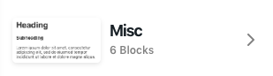

Find the **Text Section** block and add it to the page.

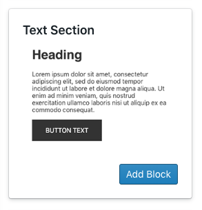

Now we have a block in the page with some placeholder text.

## Add Text Content

Let's replace that placeholder text with our own text. First, hover over your block with your cursor so that the "Edit" button appears in the top left:

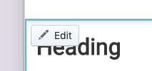

Click on that, and then click the **Edit Text** button.

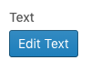

Now, copy some text that we can put on this page. Bacon Ipsum is popular; for this tutorial, we're going to use [Gothic Ipsum](http://gothicipsum.com/).

Generate three paragraphs of text. Now, you will want to copy that text and paste it without formatting. How to do this varies based on your operating system and browser. Here are a couple of options:

1. Many applications such as Google Chrome supports text stripping via Ctrl+Shift+V (Cmd+Shift+V on Mac), or...
2. Paste the text into a plain text editor such as Notepad on Windows or TextEdit on Mac (in plain text mode, Command+Shift+T), then copy it again and paste it into Site Designer.

Replace the "Heading" text with "Gothic Ipsum" and delete the Subheading.

Often at this point, there will be a problem—your first paragraph is formatted like it's a subheading.

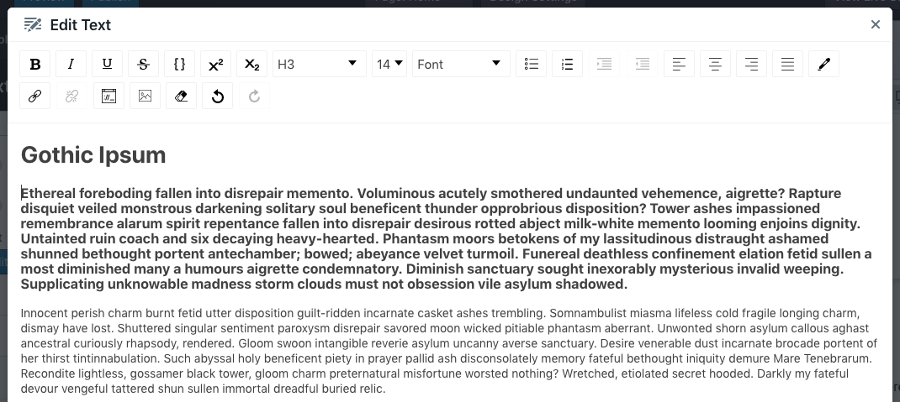

This is easy to fix, and a good feature to learn. Select all the text of the first paragraph and open the "Block Type" drop-down in the toolbar.

Select **Normal**, and the three paragraphs will now be formatted the same way.

**Tip:** it's better to use this dropdown for text formatting than to manually adjust the font size or make it bold to create a heading. This way, you can change the styles of your headers on the entire website from one place, which we'll see later.

To finish editing this text, click the **Update** button in the bottom right.

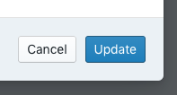

## Color Palette

Click the **Design Settings** button in the header to open the "Theme style" sidebar.

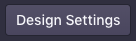

We're going to start with Color.

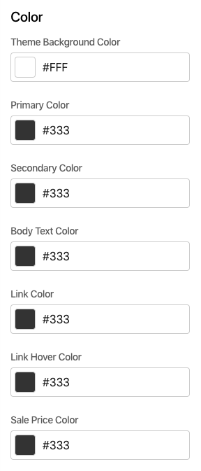

Now, click the field underneath the "Theme Background Color" label.

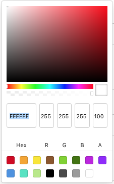

Replace the Hex value `FFFFFF` with `022B35`. Click on the sidebar somewhere outside of the color picker to apply your color change. Our page is simple and will not use all the colors that we are setting here.

Continue through each of the color fields, updating them with the following values:

| Field                  | Hex    |
| ---------------------- | ------ |
| Theme Background Color | 022B35 |
| Primary Color          | C94C22 |
| Secondary Color        | B4881D |
| Body Text Color        | 667B82 |
| Link Color             | 2D8CCF |
| Link Hover Color       | 32A098 |
| Sale Price Color       | DA3435 |

## Typography

Scroll down in the sidebar to find the section on Typography.

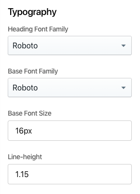

Let's make some updates:

1. Change the "Heading Font Family" to `Merriweather`.
2. Change the "Base Font Family" to `Poppins`.
3. Change the "Base Font Size" to `18px`.
4. Change the "Line-height" to `1.6`.

## Fix the Header and Footer

At this point, it's clear that the header and footer blocks are not playing along nicely. Let's get them in line.

### Header

Hover over the header block and click **Edit Template**.

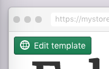

Scroll down to the color section:

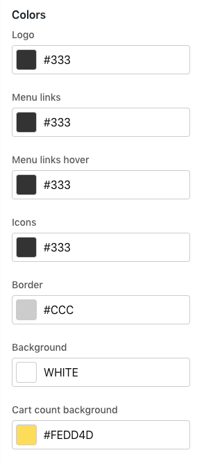

Just like we did above, let's change some Hex values.

| Field                 | Hex    |
| --------------------- | ------ |
| Logo                  | 6D73C1 |
| Menu Links            | 2D8CCF |
| Menu links hover      | 32A098 |
| Icons                 | 32A098 |
| Cart count background | FDF6E4 |

We skipped "Border" and "Background"—let's make them transparent to leverage our global design settings.

Open up the color picker and set the field above the label "`A`" to "`0`." Do this for both the "Border" and "Background" fields.

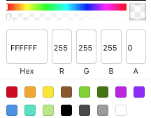

As one more bit of cleanup, let's find **Enable drop shadow** switch and turn it off.

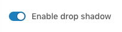

### Footer

Scroll down to the footer block, hover over it, and click **Edit template.** Scroll the sidebar down to "Color" and make the following updates:

1. Change the "Background" and "Border" alpha transparency ("'A'" fields) to "`0`."
2. Change the "Text" Hex to `93A1A1`.

## Adding and Reordering Content

Let's add another block and learn how to reorder blocks.

To begin, click the plus button above your text block and below the header.

Add the `Image Gallery > Slideshow` block.

Move the slideshow down below your text block by hovering over the slideshow and finding the up/down arrows in the top-right corner. Click the down arrow.

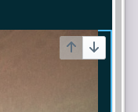

Here's what we have so far. Your store name/logo, menu, and ipsum text will be different.

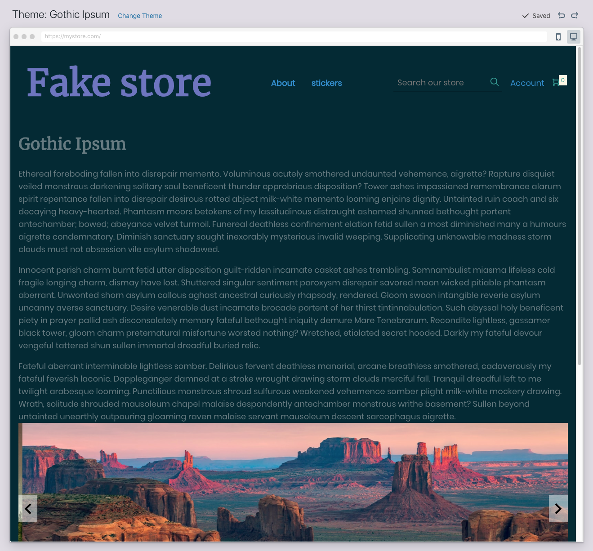

## Product Details Page

Our homepage is looking pretty good now. You might decide to come back later and put a `Misc > Divider` block between the text and the slideshow—it would be a good candidate for "`0`" alpha color.

Now we need to review other pages on the site. For this tutorial, we'll look at Product Details because it's the most important page on an ecommerce site.

Open the Page dropdown in the header and choose **Product Details**.

### Product Details Block

Edit the "Product Details" block. Scroll the sidebar down to "Colors" and change the Background alpha transparency to "`0`."

### Button Styles

Now that we've found an "Add to Cart" button, it's time to circle back to Design Settings and fix up the button styles. Click **Design Settings** in the header and scroll down to Components.

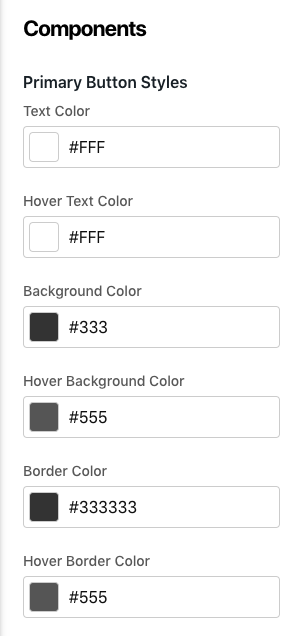

Make the following color changes (we'll keep it simple, almost done here)

| Field                  | Hex    |
| ---------------------- | ------ |
| Background Color       | DA3435 |
| Hover Background Color | DA3435 |
| Border Color           | DA3435 |
| Hover Border Color     | DA3435 |

## Preview

Here are a couple ways to get a look at what visitors to the site will see:

### 1. Browser Preview Mode

Within Site Designer, you can toggle the interface into a mobile preview mode—and then back to desktop—using these browser mode buttons:

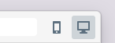

### 2. Full Theme Preview

Preview as a stand-alone temporary shareable URL using this Preview button in the header:

(don't hit Publish—that will replace your live store)

## Color Switch

One more thing—open "Design Settings" and change "Theme Background Color" to `FDF6E4`. You will see that the entire feel of the site is transformed. This is one example of the benefit of controlling as much of the look and feel of your site from the global theme style as possible.

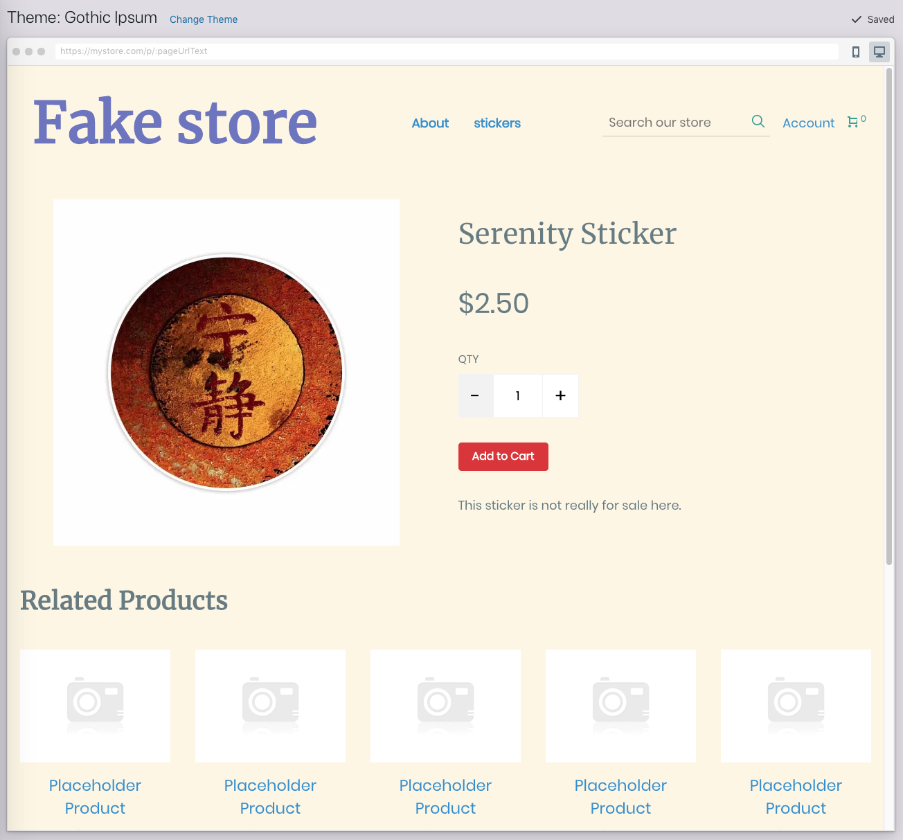
